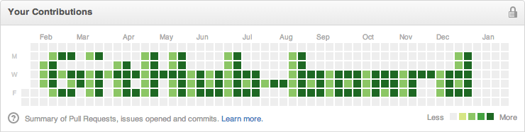

# github-board
[](https://travis-ci.org/bayandin/github-board)



### Usage
```bash
$ ./github_board.py -r ~/my/repo -t ./templates/default.tpl -e my@email.com -a center
```

### How to use on Windows?

* Install Python
* install pip like https://pip.pypa.io/en/stable/installing/#do-i-need-to-install-pip
* run command "pip install pygit2"
* Run program like explained in Usage


### Thanks
* [Eric Romano](https://github.com/gelstudios) for new cool templates ([kitty](templates/kitty.png) and [oneup](templates/oneup.png) from [gelstudios/gitfiti](https://github.com/gelstudios/gitfiti))
